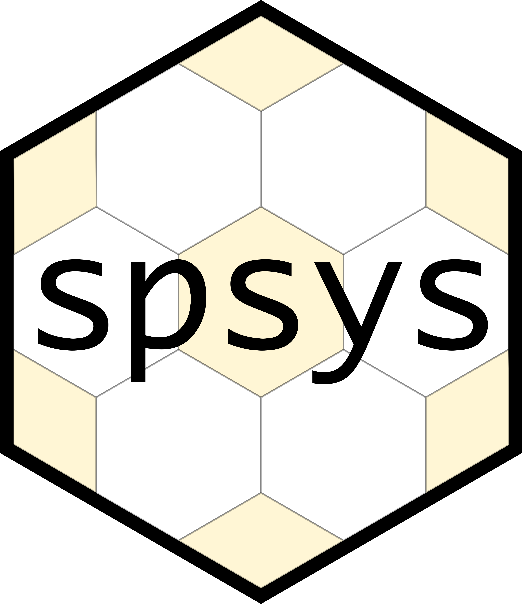

</img><br> **spsys** is an R package that allows users to explore systematic variance estimators.

Many environmental surveys use systematic sampling to produce estimates of population parameters. Estimating the precision of estimates from systematic sampling designs has proven a difficult task, with several systematic variance estimators proposed over the past several decades. While not exhaustive, `spsys` implements several different variance estimators and provides diagnostic and simulation tools to allow analysts to select an appropriate variance estimator for their population. More specifically, `spsys` provides variance estimation for surveys that rely on point estimates of attributes of interest that use the Horvitz-Thompson estimator in two-dimensional settings.

`spsys` derives its classes from the popular `sp` package, thus all `sp`-related functions such as `sp::plot`, `rgdal::writeOGR`, etc. work easily.

## Installation

Install this package directly from GitHub using `devtools`

```{r}
library(devtools)
devtools::install_github('https://github.com/brycefrank/sys)
```

## Getting Started

`spsys` operates on a modified version of the now ubiquitious `sp` package `SpatialPointsDataFrame` class. The entry point into `sys` are the `HexFrame` and `RectFrame` classes, which represent hexagonal systematic and rectangular systematic sampling configurations respectively.

For example, we can load in a set of points from a hexagonal grid:

```{r}

hex_points <- readOGR('my_hex_points.shp')
hex_frame <- HexFrame(hex_points, c('vol', 'ba'), N=10000)
```

`HexFrame` takes two arguments: a `SpatialPointsDataFrame` and a vector of column names that indicate attributes we are interested in conducting the analyses on. Here we indicate volume (vol) and basal area (ba) as our attributes of interest, and we indicate that the population size is `N=10000`. `HexFrame`, and its sister class `RectFrame` (for rectangular systematic samples), implement a standard interface upon which variance estimators can be constructed.

### Estimating Variances

Once we have wrapped our sample information within a `HexFrame` or `RectFrame`, the next step is to construct a variance estimator. For example, we can construct a variance estimator that assumes simple random sampling was conducted, as is common practice for many environmental sample surveys.

```
my_srs_estimator <- VarSRS(fpc=TRUE, diagnostic=TRUE)
```

`my_srs_estimator` now represents a function that, when we pass this function a `HexFrame` or `RectFrame`, will return the variance estimate along with other diagnostic information.

```
my_srs_estimator(hex_frame)
```

### Variance Assessment

`sys` provides two ways to assess the behavior of variance estimators: via synthetic populations and via subsampling.

One way to assess the performance of variance estimators is to treat an existing `SysFrame` as a population, and subsample repeatedly from it. `sys` enables subsampling using the following

```{r}
a <- 3
subsample(hex_frame, c(1,1), a)
```

where `c(1,1)` is the starting position in index space and `a=3` is the sampling interval. Fans of the `dplyr` package may want to use pipe operators. That is also possible

```{r}
hex_frame %>% subsample(c(1,1), a)
```

In most assessments we will be interested in all possible subsamples. Here we iterate over all possible subsamples and compute the simple random sampling with replacement estimator

```{r}
all_starts <- subsample_starts(a)

for(i in 1:nrow(all_starts)) {
  subsample(hex_frame, all_starts[i,]) %>%
    var_srs(fpc=FALSE)
}
```

## Implemented Estimators

For both hexagonal and rectangular systematic samples, the following estimators are implemented.

```
Matern  (1980)*  - var_mat
Dorazio (2003) - var_dorazio_i, var_dorazio_c
Stevens & Olsen (2003) - var_so
Non-Overlapping Neighborhoods - var_non_overlap
Simple Random Sampling - var_srs
```

The hexagonal implementation for the Matern (1980) estimator is not a strict implementation of the Matern estimator. See the vignette for further details.

## Development

This package is currently in development. Interested collaborators can email the author at bryce.frank@oregonstate.edu